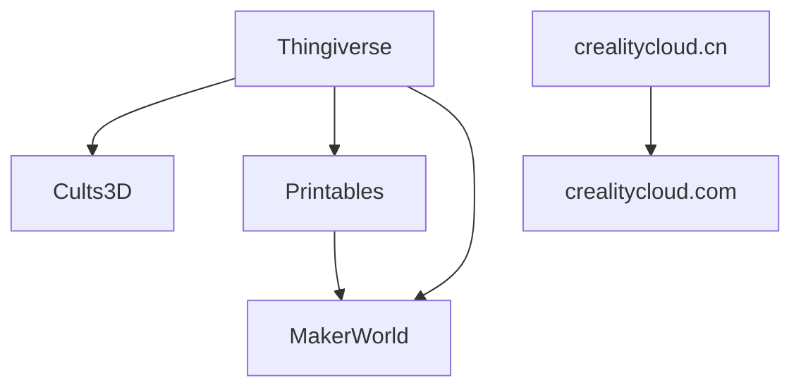

This is a feature comparison matrix of popular 3D model hosting websites focused on 3D printing. Based on the video by [Teaching Tech - YouTube](https://www.youtube.com/@TeachingTech), with additions of my own.

> [!quote] [Comparing 3D printing model websites objectively to find a winner](https://www.youtube.com/watch?v=4ZeHY44B8PU)

|                                                                            | Thingiverse | Printables | MyMiniFactory | Cults3D | Thangs | Creality Cloud | MakerWorld |
| -------------------------------------------------------------------------- | ----------- | ---------- | ------------- | ------- | ------ | -------------- | ---------- |
| Free models                                                                | ✅           | ✅          | ✅             | ✅       | ✅      | ✅              | ✅          |
| Paid models                                                                |             | ⚠️         | ⚠️            | ⚠️      | ⚠️     | ❌             |            |
| [Ads](https://www.youtube.com/watch?v=4ZeHY44B8PU&t=328s)                  | ❌          |            | ❌            | ❌      |        | ❌             |            |
| [Meta/Smart search](https://www.youtube.com/watch?v=4ZeHY44B8PU&t=399s)    | ⚠️          | ✅          | ⚠️            | ✅       | ✅      |                | ⚠️         |
| [Contests](https://www.youtube.com/watch?v=4ZeHY44B8PU&t=476s)             |             | ✅          |               | ✅       | ⚠️     | ✅              | ✅          |
| [Companion app](https://www.youtube.com/watch?v=4ZeHY44B8PU&t=518s)        | ⚠️          | ⚠️         | ✅             | ⚠️      | ✅      | ✅              | ✅          |
| [Cloud printing](https://www.youtube.com/watch?v=4ZeHY44B8PU&t=607s)       |             | ⚠️         | ✅             |         |        | ✅              | ✅          |
| [Rewards](https://www.youtube.com/watch?v=4ZeHY44B8PU&t=692s)              |             | ✅          |               |         | ⚠️     | ✅              | ✅          |
| [Communities](https://www.youtube.com/watch?v=4ZeHY44B8PU&t=750s)          | ✅           | ✅          |               |         |        | ✅              | ✅          |
| [Blog/guides/articles](https://www.youtube.com/watch?v=4ZeHY44B8PU&t=810s) |             | ✅          |               | ✅       | ✅      | ✅              |            |
| Download w/o login                                                         | ✅           | ✅          | ✅             | ❌      | ❌     | ❌             | ⚠️         |
| SCAD Customizer                                                            | ✅           |            |               |         |        |                | ✅          |

- MakerWorld requires login to download all files. When not logged in, you can only download files individually after completing a challenge.

## Rewards

### Printables

- https://help.prusa3d.com/article/how-do-prusameters-on-printables-work_365065
- https://www.printables.com/prusameter
- https://www.printables.com/prusameter/rewards

#### Earn

| title               | description                              | points |
|---------------------|------------------------------------------|--------|
| Completed profile   | avatar, bio, location, languages         | 20     |
| Publish a model     | up to 10 new models in total             | 10     |
| Create a collection | up to 3 non-empty collections            | 5      |
| Upload a make       | up to 100 Prusameters per calendar month | 1-10   |
|                     | Model reaches 30 downloads and 3 likes   | 10     |
|                     | Model reaches 100 downloads and 10 likes | +50    |
|                     | Model reaches 200 downloads and 15 likes | +100   |
|                     | Model reaches 400 downloads and 20 likes | +200   |

#### Redeem

| title                                          | description                                                                                                                                                                                                                                                                                | points | USD     |
| ---------------------------------------------- | ------------------------------------------------------------------------------------------------------------------------------------------------------------------------------------------------------------------------------------------------------------------------------------------ | ------ | ------- |
| Prusament PLA                                  | The voucher can be applied to any regular PLA Prusament 1 kg except rPLA and Refill. Only one voucher can be used per order. It is not possible to combine several vouchers into one.                                                                                                      | 350    | $29.99  |
| Prusament PETG                                 | The voucher can be applied to any regular PETG Prusament 1 kg except PETG Carbon Fiber, Tungsten, V0, Matte Black, and Refill. Only one voucher can be used per order. It is not possible to combine several vouchers into one.                                                            | 350    | $29.99  |
| Prusament ASA                                  | The voucher can be applied to any regular ASA Prusament 850 g. Only one voucher can be used per order. It is not possible to combine several vouchers into one.                                                                                                                            | 350    | $29.99  |
| Prusa CORE One                                 | 3D printer: Original Prusa CORE One Kit! Only one voucher can be used per order. It is not possible to combine several vouchers into one.                                                                                                                                                  | 29000  | $949.00 |
| Original Prusa MK4S                            | 3D printer kit: Original Prusa MK4S! Only one voucher can be used per order. It is not possible to combine several vouchers into one.                                                                                                                                                      | 25000  | $729.00 |
| Original Prusa MINI+                           | 3D printer Original Prusa MINI+ kit - smart and compact 3D printing workhorse. Only one voucher can be used per order. It is not possible to combine several vouchers into one.                                                                                                            | 10000  | $429.00 |
| Prusa Art - Set of 3 Posters                   | You can choose Technical Art or Infill Art.                                                                                                                                                                                                                                                | 300    | $20.99  |
| Original Prusa Heatbed Mousepad                | Only one voucher can be used per order. It is not possible to combine several vouchers into one.                                                                                                                                                                                           | 240    | $14.99  |
| Prusament Refill                               | The voucher can be applied to PLA or PETG Prusament Refill. Only one voucher can be used per order. It is not possible to combine several vouchers into one.                                                                                                                               | 340    | $26.99  |
| Official Printables T-shirt                    | You can choose any size. Only one voucher can be used per order. It is not possible to combine several vouchers into one.                                                                                                                                                                  | 200    | $24.99  |
| Prusament Dragon T-shirt                       | You can choose any size. Only one voucher can be used per order. It is not possible to combine several vouchers into one.                                                                                                                                                                  | 300    | $24.99  |
| Original Prusa T-shirt MK4 Blueprint           | You can choose any size. Only one voucher can be used per order. It is not possible to combine several vouchers into one.                                                                                                                                                                  | 300    | $24.99  |
| Original Prusa T-shirt PrusaSlicer             | You can choose any size. Only one voucher can be used per order. It is not possible to combine several vouchers into one.                                                                                                                                                                  | 300    | $24.99  |
| Original Prusa T-shirt Classic or Jo's Edition | You can choose any size. Only one voucher can be used per order. It is not possible to combine several vouchers into one.                                                                                                                                                                  | 240    | $19.99  |
| Original Prusa Hoodie                          | You can choose any size. Only one voucher can be used per order. It is not possible to combine several vouchers into one.                                                                                                                                                                  | 600    | $43.99  |
| Original Prusa Snapback                        | You can choose any Prusa Snapback. Only one voucher can be used per order. It is not possible to combine several vouchers into one.                                                                                                                                                        | 375    | $29.99  |
| Original Prusa Beanie                          | Only one voucher can be used per order. It is not possible to combine several vouchers into one.                                                                                                                                                                                           | 280    | $18.99  |
| Original PrusaSlicer Mug                       | Only one voucher can be used per order. It is not possible to combine several vouchers into one.                                                                                                                                                                                           | 250    | $19.99  |
| $40 voucher for Prusa 3D printer               | A $40 voucher that can be redeemed when purchasing a Prusa 3D printer CORE One, MK4S, XL, MINI+, SL1S (including kit versions). Does not apply to upgrades and conversion kit. Only one voucher can be used per transaction, and it's not possible to combine multiple vouchers into one.  | 350    | $40.00  |
| $100 voucher for Prusa 3D printer              | A $100 voucher that can be redeemed when purchasing a Prusa 3D printer CORE One, MK4S, XL, MINI+, SL1S (including kit versions). Does not apply to upgrades and conversion kit. Only one voucher can be used per transaction, and it's not possible to combine multiple vouchers into one. | 1000   | $100.00 |
| $200 voucher for Prusa 3D printer              | A $200 voucher that can be redeemed when purchasing a Prusa 3D printer CORE One, MK4S, XL, MINI+, SL1S (including kit versions). Does not apply to upgrades and conversion kit. Only one voucher can be used per transaction, and it's not possible to combine multiple vouchers into one. | 3000   | $200.00 |
| $400 voucher for Prusa 3D printer              | A $400 voucher that can be redeemed when purchasing a Prusa 3D printer CORE One, MK4S, XL, MINI+, SL1S (including kit versions). Does not apply to upgrades and conversion kit. Only one voucher can be used per transaction, and it's not possible to combine multiple vouchers into one. | 7000   | $400.00 |
| 2× Prusament spool                             | Voucher for 2 pcs Prusament PLA, PETG, ASA on 1kg or 850g spool of any regular color except rPLA, PETG Carbon Fiber, Tungsten, V0, Matte Black, and Refill. Only one voucher can be used per order. It is not possible to combine several vouchers into one.                               | 700    | $59.98  |
| 3× Prusament spool                             | Voucher for 3 pcs Prusament PLA, PETG, ASA on 1kg or 850g spool of any regular color except rPLA, PETG Carbon Fiber, Tungsten, V0, Matte Black, and Refill. Only one voucher can be used per order. It is not possible to combine several vouchers into one.                               | 1050   | $89.97  |
| 3D Printing and Modeling for Beginners (MK4)   | Online course                                                                                                                                                                                                                                                                              | 90     |         |
| 3D Printing and Modeling for Beginners (MINI+) | Online course                                                                                                                                                                                                                                                                              | 90     |         |
| Basics of Product Photography                  | Online course                                                                                                                                                                                                                                                                              | 350    |         |
| Design Principles for 3D Printed Parts         | Online course                                                                                                                                                                                                                                                                              | 180    |         |
| 3D Modeling in Fusion 360                      | Online course                                                                                                                                                                                                                                                                              | 350    |         |
| 3D Printing and Modeling for Beginners (MK3S+) | Online course                                                                                                                                                                                                                                                                              | 90     |         |
| Donating Prusament to Education                | Join us in supporting education and donate your Prusameters to benefit students. Your Prusameters will be converted into donated Prusament spools. Thank you for your donation!                                                                                                            | 200    |         |
| Basics of 3D Printing with Josef Prusa         | You can choose language variation. Only one voucher can be used per order. It is not possible to combine several vouchers into one.                                                                                                                                                        | 65     | $4.99   |
### MakerWorld

https://makerworld.com/en/points

#### Earn

| title                             | description                                                                                                                                                                                                                                                                                                                                                                                                  |
|-----------------------------------|--------------------------------------------------------------------------------------------------------------------------------------------------------------------------------------------------------------------------------------------------------------------------------------------------------------------------------------------------------------------------------------------------------------|
| Upload a Model                    | Each new upload can earn 10 points, and up to 50 points in total.                                                                                                                                                                                                                                                                                                                                            |
| Upload a Print Profile            | Each new upload can earn 3 points, and up to 15 points in total.                                                                                                                                                                                                                                                                                                                                             |
| High-Quality Model Reward         | 1 Successful Print = 2 Downloads  3 downloads are counted when a user downloads and successfully prints a model.  The high-quality model reward has no time constraints; points are earned upon reaching specific download milestones. The points reward is progressive for each model at 4 milestones.                                                                                       |
| 1~50                              | 15 points per 10 downloads                                                                                                                                                                                                                                                                                                                                                                                   |
| 51~500                            | 12 points per 25 downloads                                                                                                                                                                                                                                                                                                                                                                                   |
| 501~1000                          | 20 points per 50 downloads                                                                                                                                                                                                                                                                                                                                                                                   |
| >1000                             | 30 points per 100 downloads                                                                                                                                                                                                                                                                                                                                                                                  |
| High-Quality Print Profile Reward | 1 Successful Print = 2 Downloads  3 downloads are counted when a user downloads and successfully prints a print profile.  The high-quality print profile reward has no time constraints; points are earned upon reaching specific download milestones. In order to receive points, each print profile needs to keep the average rating ≥4 stars, then you will earn points at each milestone. |
| 1~50                              | 3 points per 10 downloads                                                                                                                                                                                                                                                                                                                                                                                    |
| 51~500                            | 3 points per 25 downloads                                                                                                                                                                                                                                                                                                                                                                                    |
| 501~1000                          | 5 points per 50 downloads                                                                                                                                                                                                                                                                                                                                                                                    |
| >1000                             | 8 points per 100 downloads                                                                                                                                                                                                                                                                                                                                                                                   |
| Create models using MakerLab      | You can earn up to 10 points.                                                                                                                                                                                                                                                                                                                                                                                |
| Rate Print Profiles               | If your rating is one of the first five ratings for a print profile, you can earn up to 10 points.                                                                                                                                                                                                                                                                                                           |
| Complete personal profile         | Completed your personal information and upload an avatar to earn 20 points.                                                                                                                                                                                                                                                                                                                                  |

#### Redeem

| title                                                                                                                                     | description                                                                                                                                                                                                                             | points | USD      |
| ----------------------------------------------------------------------------------------------------------------------------------------- | --------------------------------------------------------------------------------------------------------------------------------------------------------------------------------------------------------------------------------------- | ------ | -------- |
| Gift Card for $40                                                                                                                         | This gift card is only valid for use in the US and cannot be changed after it has been redeemed.                                                                                                                                        | 490    | $40      |
| Maker's Essential Kit A                                                                                                                   | This discount code will provide a 99% discount on the purchase of this item in AU and cannot be changed after it has been redeemed.                                                                                                     | 1200   | $165     |
| [LED Lamp Kit 001](https://us.store.bambulab.com/products/led-lamp-kit-001?id=41806987395208)                                             | This discount code will provide a 99% discount on the purchase of this item in the US and cannot be changed after it has been redeemed.                                                                                                 | 132    | $12.87   |
| [Wireless Mouse Components Kit 002](https://us.store.bambulab.com/products/wireless-mouse-components-kit-002?id=41806859403400)           | This discount code will provide a 99% discount on the purchase of this item in the US and cannot be changed after it has been redeemed.                                                                                                 | 132    | $12.87   |
| [Marble Run Components Kit 003](https://us.store.bambulab.com/products/marble-run-components-kit-003)                                     | This discount code will provide a 99% discount on the purchase of this item in the US and cannot be changed after it has been redeemed.                                                                                                 | 110    | $10.89   |
| [Engine Model Components Kit 005](https://us.store.bambulab.com/products/engine-model-components-kit-005)                                 | This discount code will provide a 99% discount on the purchase of this item in the US and cannot be changed after it has been redeemed.                                                                                                 | 110    | $10.89   |
| [Jet Engine Model Components Kit 006](https://us.store.bambulab.com/products/jet-engine-model-components-kit-006?id=41806959804552)       | This discount code will provide a 99% discount on the purchase of this item in the US and cannot be changed after it has been redeemed.                                                                                                 | 275    | $26.73   |
| [Triple-axis Tourbillon Model Components Kit 007](https://us.store.bambulab.com/products/triple-axis-tourbillon-model-components-kit-007) | This discount code will provide a 99% discount on the purchase of this item in the US and cannot be changed after it has been redeemed.                                                                                                 | 440    | $43.56   |
| [Boat Model Components Kit 010](https://us.store.bambulab.com/products/boat-model-components-kit-010?id=41823193727112)                   | This discount code will provide a 99% discount on the purchase of this item in the US and cannot be changed after it has been redeemed.                                                                                                 | 55     | $5.4351  |
| [Clock Components Kit 011](https://us.store.bambulab.com/products/clock-components-kit-011)                                               | This discount code will provide a 99% discount on the purchase of this item in the US and cannot be changed after it has been redeemed.                                                                                                 | 88     | $8.91    |
| [Maker's Beginner Kit](https://us.store.bambulab.com/products/makers-beginner-kit)                                                        | This discount code will provide a 99% discount on the purchase of this item in the US and cannot be changed after it has been redeemed (Please note that the product does not include the 3D printed parts as shown in the main image). | 110    | $10.8801 |
| Lichtenstein Castle                                                                                                                       | MakerWorld exclusive model is available for you to redeem.                                                                                                                                                                              | 50     |          |
| Panzerkampfwagen IV Tank                                                                                                                  | MakerWorld exclusive model (a digital 3D model file rather than physical prints)                                                                                                                                                        | 100    |          |
| MakerLab Credits x 10                                                                                                                     | for MakerLab AI apps                                                                                                                                                                                                                    | 1      |          |
| MakerLab Credits x 100                                                                                                                    | for MakerLab AI apps                                                                                                                                                                                                                    | 10     |          |

##### [Redeem Cash][]

Exclusive points, earned through exclusive models, can be redeemed for cash or valuable items in our points shop.

1. Cash redemption is limited to exclusive points, with an exchange rate of 1 exclusive point for 0.066 USD.
2. The minimum redemption amount is 100 USD, while the maximum is 1000 USD.

[Redeem Cash]: https://makerworld.com/en/points?type=redeemCash

### Creality Cloud

https://www.crealitycloud.com/mission-center/eshop

## Imports

These are the supported import paths to copy models from one site to another. The services are provided by the destination website.

